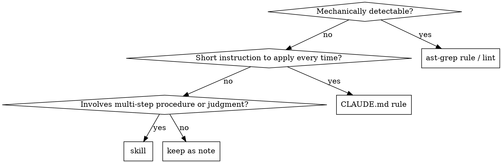

# Retrospective Codify

Toward the end of a task, extract the insight of "if only I had known this first, I would not have taken detours" and pin it down as one of: a static rule, a skill, or an always-on rule. Prioritize landing it in a reproducible form that does not rely on prompts.

## When to use

- Right before task completion, or when the user says "leave the lesson behind" or "codify it"
- When you arrived at the solution after trial and error (stuck on the first attempt, built a wrong hypothesis, burned time due to missing docs, etc.)
- When you might perform a similar task again in the future

When not to use:
- Simple tasks that passed on the first try (nothing to extract)
- Project-specific one-off handling (a commit message is enough)

## Workflow

1. **Pair failure with success**: From the current task, write out the following 3 points.
   - The first attempt (what you did / how it failed)
   - The final solution (what worked)
   - The bridging insight (why the first attempt did not get there)
2. **Verbalize "what you should have known first"**: Summarize the insight in 1-3 sentences. Write it not as retrospection but as an instruction to your future self (in imperative form: "do not do X" / "check Y first").
3. **Classify**: Decide the output destination following the decision table below.
4. **Dedup check (mandatory)**: Before proposing, cross-check against existing knowledge. If a duplicate or nearby rule exists, choose "append to / update existing" rather than "add new." Skipping this step bloats skills / rules.

   Extract 2-3 search keys from the insight (tool names, API names, symptom words, antonyms). Example: if the insight is "use pnpm v10," use `pnpm`, `packageManager`, `lockfile`.

   Match targets and minimum searches:
   ```
   # skill duplicates (global)
   ls ~/.claude/skills/
   Grep "<key>" ~/.claude/skills/*/SKILL.md

   # CLAUDE.md duplicates
   Grep "<key>" ~/.claude/CLAUDE.md
   Grep "<key>" <project-root>/CLAUDE.md   # if there is a matching project

   # lint rule duplicates
   ls <project-root>/rules/
   Grep "<key>" <project-root>/rules/
   ```

   Classify the result into 4 tiers:
   - **New**: no hits -> normal proposal
   - **Append to existing**: a related skill/rule exists and the new info is complementary -> propose "append to existing"
     - "Partial overlap" (part of the insight is covered by the existing one, rest is new) also falls in this tier. Write the overlapping part under "Duplicate detected," and the new part under "Adoption candidates" (`[skill append]` or `[rule]`) separately.
   - **Duplicate with existing (no proposal needed)**: the existing entry already fully covers the same insight -> zero proposals, but keep the "Duplicate detected" line in the presentation format (for auditability). Attach the existing skill name + the relevant section name (or line number) as evidence on the Duplicate detected line.
   - **Undecidable**: the agent cannot tell whether it is a duplicate -> show the match result to the user and ask for judgment
5. **Write out**: Generate the artifact following the template (below) for the chosen format.
6. **Confirm**: Show the diff to the user and get approval. If rejected, keep it as a session note instead of a skill.

## Classification decision



| Decision axis | Output destination | Example |
|---|---|---|
| Detectable at the code/config syntax level | `ast-grep` rule or existing linter config | "Do not use `Array.from(set).length`, use `set.size`" |
| Short, always-applied, no judgment involved | `CLAUDE.md` (user global / project) | "Use pnpm v10 or later" |
| Requires procedure, contextual judgment, or templates | New skill or append to existing skill | "Steps to write a C binding for MoonBit" |
| Project-specific and one-off | Do not adopt (keep in commit message / PR description) | — |

**Principle: prefer ast-grep**: For things that are statically detectable, do not write them in prompts or docs; always make them an `ast-grep` rule (as the user's global rule).

**CLAUDE.md write destinations**:
- Cross-language / cross-tool general rules -> `~/.claude/CLAUDE.md`
- Limited to a specific repository -> that repository's `CLAUDE.md`

## Output templates

### ast-grep rule
See the `ast-grep-practice` skill. Add YAML under the `rules/` directory and always write a valid / invalid pair under `rule-tests/`.

### Append to CLAUDE.md
```markdown
# <append to existing section>
- <one imperative sentence> (reason: <short rationale>)
```
Always attach the reason in parentheses (so that your future self can judge edge cases).

### New skill
Follow the minimal template from `writing-skills` (superpowers):
```markdown
---
name: <kebab-case>
description: Use when <specific situation> / <symptom>
---

# <Title>

## Purpose
## When to use
## Workflow
## Pitfalls
```

## Concrete examples

### Example 1: Codify as an ast-grep rule (mechanically detectable)

- First attempt: In TypeScript, retrieved a set's size with `Array.from(set).length`, but review pointed out this is inefficient.
- Final solution: Use `set.size`.
- Insight: For `Set` / `Map` size, use the `.size` property. `Array.from(...).length` is detectable at the syntax level.

-> Add `rules/no-array-from-size.yml`:
```yaml
id: no-array-from-size
language: TypeScript
severity: warning
rule:
  pattern: Array.from($COLL).length
message: Set/Map のサイズは .size プロパティを使う。
```

### Example 2: Codify as a CLAUDE.md rule (short always-on rule)

- First attempt: Ran `pnpm install` and CI broke due to a lockfile format diff.
- Final solution: Aligned pnpm's version to the v10 line.
- Insight: pnpm changes its lockfile across versions. Always use v10 or later.

-> Append to the "ツール" section of `~/.claude/CLAUDE.md`:
```markdown
- pnpm は v10 以上を使う（理由: lockfile 形式が v9 以前と非互換で CI 差分が出る）
```

### Example 3: Codify as a new skill (procedure + judgment involved)

- First attempt: To call a C library from MoonBit, tried several approaches and got stuck on the placement of FFI declarations and stubs.
- Final solution: The combination of an `extern "c"` declaration + a stub using `moonbit.h` + `native-stub` / `link.native` settings in `moon.pkg.json`.
- Insight: It does not fit in a single step; you need to understand the three layers — declaration, stub, and build config — together.

-> Carve out the procedure and templates as a new skill `moonbit-c-binding` (since it already exists, this example is the case of choosing "append to existing" via the dedup check).

## Red flags (watch out for rationalizations)

Stop once if the following thoughts appear.

| Rationalization that surfaces | Reality |
|---|---|
| "It is project-specific but let's make a skill just in case" | Skills bloat and searchability drops. A commit message / PR is enough. |
| "Skip approval and write it out first; I can show it later" | Modifying CLAUDE.md / skills on your own makes future behavior unpredictable. Always: propose -> approve -> write out. |
| "I kind of could write it in ast-grep, but writing it in natural language as a rule is faster" | Writing statically detectable things in prose means agents do not follow them. Prefer ast-grep. |
| "The insight is thin, but I have to write something to save face" | Zero proposals is also a correct answer. An empty retrospective causes no harm. |
| "Dedup checks are tedious; skip them, erase duplicates later" | If duplicate rules remain, behavior splits. Dedup is a mandatory step. |
| "Omit the failure side and only write the final solution" | Without describing the failure, your future self will fall into the same pitfall again. |

## Presentation format to the user

At the end of a task, present the stock-taking in the following form. **Multiple lessons are fine. Explicitly list duplicates and non-adoptions too, to leave a trace of the judgment.**

```
## Retrospective

### Lesson 1: <short label>
- First failure: <1 line>
- Final solution: <1 line>
- Insight: <1 line>

### Lesson 2: <short label>      # omit this block if there is only 1 lesson
- First failure: <1 line>
- Final solution: <1 line>
- Insight: <1 line>

## Proposals

Adoption candidates:
- [lint] <rule name>: <1 line> (artifact: <path>, from lesson N)
- [skill append] <existing skill name>: <1 line> (from lesson N)
- [skill new] <skill name>: <1 line> (from lesson N)
- [rule] CLAUDE.md (global/project): <1 line> (from lesson N)

Duplicate detected (no proposal needed):
- <lesson N>: fully covered by <section name or line number> of existing <skill/rule name> -> no addition

Not adopted:
- <lesson N>: <one-line reason for non-adoption> (e.g. project-specific / hard to express in lint across files / absorbed by another lesson)

Please indicate which to adopt by number or item name. Zero proposals is also a valid conclusion.
```

**Format rules:**
- If there is only 1 lesson, omit the `### Lesson N` heading and write only one Retrospective block
- If any of "Adoption candidates," "Duplicate detected," or "Not adopted" is empty, omit the whole section (do not write a "none" line)
- Always end each proposal line with "from lesson N" (if it spans multiple lessons, you may enumerate as "from lessons 1, 3")
- When "Adoption candidates" is empty and only "Duplicate detected" remains, replace the closing sentence from `Please indicate which to adopt` with `No adoption candidates. Please review for the record.`
- Write out only items the user instructs you to adopt. Do not write silently.

### Presentation example: all lessons already covered (Duplicate detected only)

```
## Retrospective

### Lesson 1: <label>
- First failure: ...
- Final solution: ...
- Insight: ...

## Proposals

Duplicate detected (no proposal needed):
- Lesson 1: fully covered by `<section name>` of existing skill `<skill name>` -> no addition

No adoption candidates. Please review for the record.
```

### Presentation example: partial overlap (append to existing + Duplicate detected)

```
## Proposals

Adoption candidates:
- [skill append] <existing skill name>: <1 line for the new portion> (from lesson 1, complements existing section `<section name>`)

Duplicate detected (no proposal needed):
- Lesson 1 (version value portion): already covered by the tools section in `~/.claude/CLAUDE.md` -> no append needed
```

## Common failures

- **Granularity too fine**: codifying the one-off specifics (a specific function name, a specific version) -> abstract it up to the level of "what to check"
- **Tends to be written as a prompt**: writing a statically detectable rule in natural language in CLAUDE.md -> move it to an `ast-grep` rule
- **Does not write the reason**: the rule's rationale is not left behind, and the future self cannot judge why to follow it -> always attach a `Why:`
- **Writes out on its own**: updates CLAUDE.md or skills without user approval -> always follow propose -> approve -> write out in that order
- **Omits verbalizing the failure**: writes only "the final solution is X" and does not leave why the first move got stuck -> without a description on the failure side, your future self will fall into the same pitfall again

## Related skills

- `superpowers:writing-skills` — template and TDD flow for writing a new skill
- `ast-grep-practice` — how to write and test when codifying as a lint rule
- `update-config` — when changes to settings.json / permissions are required
